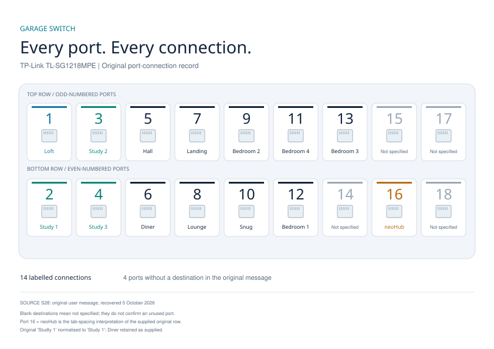

# GarageSwitch — port connections

[Master overview](../BlandingsNetwork.md) · [Evidence and sources](../07-Evidence/Sources.md)

### GarageSwitch diagram and device-name recovery (S9)

**HISTORICAL USER REQUIREMENTS, 21 August 2025:** the user requested an A4 landscape PDF for printing, then an A5 version to print and stick on the switch, A6/A7 versions to inspect, and A4 sheets containing two A5 or four A6 diagrams. The final returned request rotates each of the four diagrams by 90 degrees to increase its size while retaining four on A4.

The assistant supplied these exact artifact names: `GarageSwitch.pdf`, `GarageSwitch_A5.pdf`, `GarageSwitch_A6.pdf`, `GarageSwitch_A7.pdf`, `GarageSwitch_A4_with_2xA5.pdf`, `GarageSwitch_A4_with_4xA6.pdf` and `GarageSwitch_A4_with_4xA6_rotated.pdf`. These names are recovery/search identifiers; the files themselves were not recovered or inspected, and no claim of successful printing is implied. An eight-A7 sheet and combined multi-page PDF were offered, without a returned user request or delivered file.

`GarageSwitch` is the historical diagram label. The user has now recovered the original message identifying the switch model and numbered destinations (S28 below). Its current management hostname/address, later wiring changes, downstream ports and PoE consumers remain unverified. Preserve the confirmed switch model and released-record address separately.
## HomeNetwork findings (S27)

Overview identifies the garage-cabinet core switch as TP-Link TL-SG1218MPE; addressing/reservations give `10.59.60.136`, MAC `9C:A2:F4:71:70:41`, label `TP-Link_TL-SG1218MPE`. This strengthens the historical candidate mapping, but does not establish the current management hostname or wiring. The dedicated garage-switch/cabling pages and topology diagrams are empty: no numbered ports can be extracted from them.

## Recovered original port map (S28)

Source: user's original-message transcription supplied on **5 October 2026**, identifying **Garage Switch / TP Link - TL-SG1218MPE**. This records the recovered original connections; it is not a new inspection of present-day wiring. The lost PDF is no longer needed to preserve this numbered map. The new diagram is a reconstruction from the supplied text, not a recovered copy of that PDF.

[Printable A4 landscape PDF](../diagrams/GarageSwitch.pdf) · [Editable SVG diagram](../diagrams/GarageSwitch.svg)

The layout follows the supplied odd-numbered top row and even-numbered bottom row. “Studty 1” is normalised to **Study 1**; **Diner** is retained as supplied. The tabbed row is interpreted as **port 16 = neoHub**, with port 14 blank. Ports 14, 15, 17 and 18 have no destination specified; do not infer they are unused or spare.

| Numbered port | Room / destination in original message |
|---:|---|
| 1 | Loft |
| 2 | Study 1 |
| 3 | Study 2 |
| 4 | Study 3 |
| 5 | Hall |
| 6 | Diner |
| 7 | Landing |
| 8 | Lounge |
| 9 | Bedroom 2 |
| 10 | Snug |
| 11 | Bedroom 4 |
| 12 | Bedroom 1 |
| 13 | Bedroom 3 |
| 14 | Not specified |
| 15 | Not specified |
| 16 | neoHub |
| 17 | Not specified |
| 18 | Not specified |

There are **14 named destinations and 4 unspecified destinations**. Port 1 corroborates the earlier loft-link narrative, but the downstream Netgear port and endpoint wiring are not provided. The router uplink port is not identified in this list; do not assign it to a blank port.

### Remaining verification

Confirm whether any connections have changed since the original message, the port-16 interpretation, blank-port usage, wall-socket/cable labels, loft-switch port, router uplink and actual PoE loads. Add current observations with a date and user confirmation; preserve this original map as history if wiring changes.
