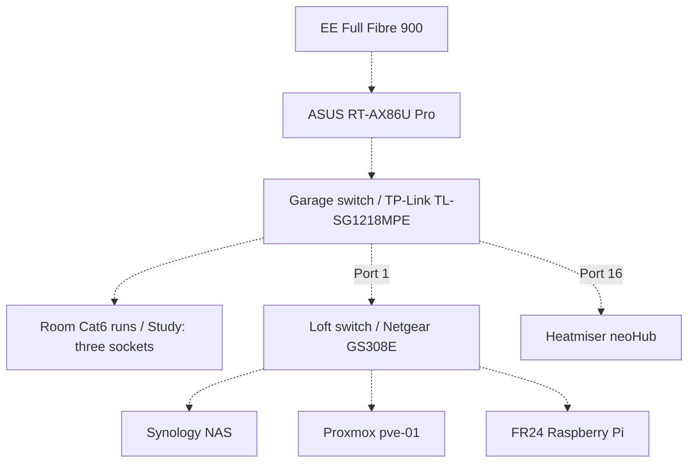

# Physical topology and cabling

[Master overview](../BlandingsNetwork.md) · [Evidence and sources](../07-Evidence/Sources.md)

## Historical topology recovered from HomeNetwork (S27)

Repository overview: EE → ASUS router → TP-Link TL-SG1218MPE in garage cabinet. Cat6 room runs return to the garage switch; one socket per room, three in Study. A Cat6 loft uplink reaches Netgear GS308E; NAS, Proxmox and FR24 Raspberry Pi are shown there. NeoHub is shown wired from the garage switch. These are documented historical connections, not a live inspection or numbered port map.

<!-- DIAGRAM:physical-topology:BEGIN -->

<!-- DIAGRAM:physical-topology:END -->

The diagram represents S27's recorded topology; arrows are not port assignments. See [GarageSwitch.md](GarageSwitch.md), [LoftSwitch.md](LoftSwitch.md) and [FlightReceiver.md](../03-Services/FlightReceiver.md). Recover numbered ports, outlet labels, uplink endpoints, cable labels and current PoE loads from the original PDF or a physical inventory. HomeNetwork's cabling and switch pages and Mermaid files are empty.

## Numbered garage-port evidence recovered (S28)

The user has supplied the original numbered map: garage port **1 → Loft**, **16 → neoHub** (tab-spacing interpretation), plus the room destinations on ports 2–13. See the complete [18-port table and reconstructed diagram](GarageSwitch.md#recovered-original-port-map-s28). Ports 14/15/17/18 remain unspecified. This fills the historical numbered-port gap; current wiring, router uplink, downstream port numbers and PoE loads still need verification.

## Stored diagram source and printable version

[PhysicalTopology.json](../diagrams/source/PhysicalTopology.json) generates the marked Mermaid block, [Mermaid source](../diagrams/PhysicalTopology.mmd), [SVG diagram](../diagrams/PhysicalTopology.svg) and [A4 landscape PDF](../diagrams/PhysicalTopology.pdf). Follow the [regeneration instructions](../diagrams/README.md). Dashed links explicitly describe historical connections and do not establish live wiring.
